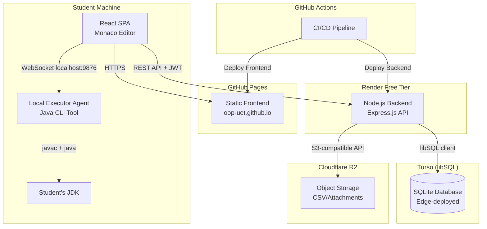
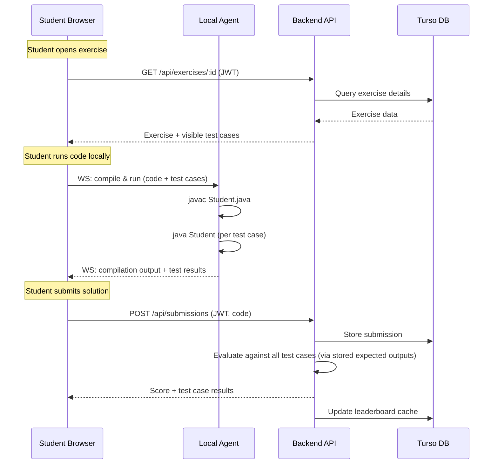
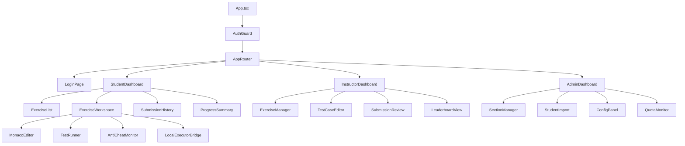
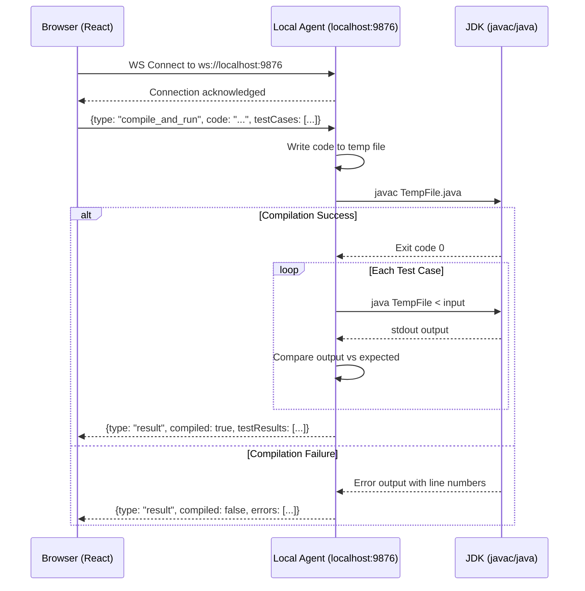
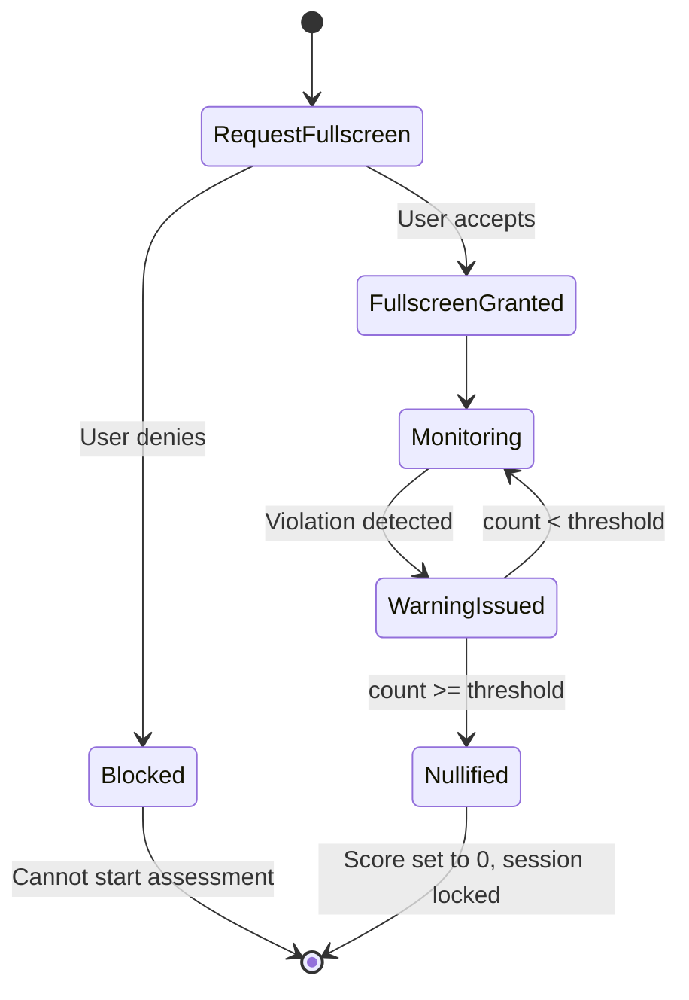
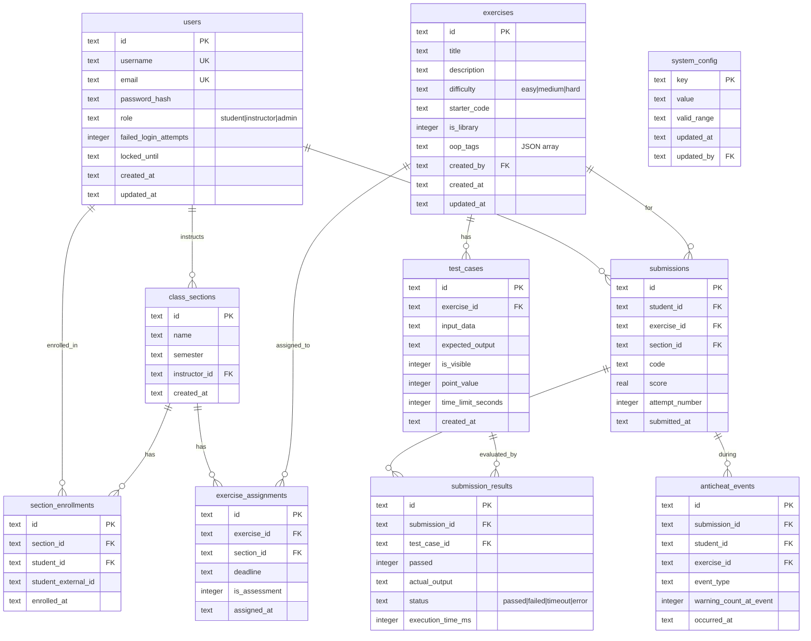

# Design Document: OOP Learning Platform

## Overview

The OOP Learning Platform is a web-based system for UET-VNU students to practice Java OOP programming. The platform follows a client-server architecture with a React SPA frontend hosted on GitHub Pages, a Node.js backend deployed on Render free tier, Turso (libSQL) for database storage, Cloudflare R2 for file storage, and a local agent for Java code execution on student machines.

The core design philosophy is **zero-cost operation** while serving up to 80 concurrent students. Code execution happens locally on student machines (via a lightweight Java agent), eliminating the most expensive cloud computing requirement. The backend handles authentication (self-managed JWT with bcrypt), data persistence, and lightweight API operations.

### Key Design Decisions

| Decision | Choice | Rationale |
|----------|--------|-----------|
| Frontend Host | GitHub Pages | Free, reliable, HTTPS by default, fits org structure |
| Backend Runtime | Render Free Tier (Node.js) | 750 free hours/month, auto-sleep saves quota, simple deployment |
| Database | Turso Free Tier (libSQL/SQLite) | 5GB storage, 500M rows read/month, 10M rows written/month, edge-ready, SQLite-compatible |
| File Storage | Cloudflare R2 Free Tier | 10GB storage, S3-compatible API, zero egress fees, 1M Class A + 10M Class B ops/month |
| Authentication | Self-managed JWT (bcrypt + jsonwebtoken) | Zero external dependency, full control, no third-party auth quota limits |
| ORM | Drizzle ORM (@libsql/client) | Native Turso/libSQL support, lightweight, TypeScript-first |
| Code Execution | Local Agent (Java CLI tool) | Zero server cost, uses student's JDK, no sandbox security concerns |
| Code Editor | Monaco Editor | VS Code engine, excellent Java support, free |
| Anti-Cheat | Fullscreen API + Visibility API | Client-side, no additional infrastructure needed |

## Architecture

### System Architecture Diagram



### Request Flow



## Components and Interfaces

### Backend API (Node.js + Express)

#### Technology Stack
- **Runtime**: Node.js 20 LTS
- **Framework**: Express.js 4.x
- **ORM**: Drizzle ORM with `@libsql/client` (Turso/libSQL adapter)
- **Authentication**: Self-managed JWT (`jsonwebtoken` for token signing/verification, `bcrypt` for password hashing)
- **Validation**: Zod for request validation
- **File Storage Client**: `@aws-sdk/client-s3` (S3-compatible client for Cloudflare R2)
- **File Parsing**: `csv-parse` for CSV, `xlsx` for Excel files

#### API Endpoints

##### Authentication
| Method | Endpoint | Description | Auth |
|--------|----------|-------------|------|
| POST | `/api/auth/login` | Authenticate user | Public |
| POST | `/api/auth/refresh` | Refresh JWT token | Authenticated |
| POST | `/api/auth/logout` | Invalidate session | Authenticated |

##### Admin - Class Sections
| Method | Endpoint | Description | Auth |
|--------|----------|-------------|------|
| GET | `/api/admin/sections` | List all class sections | Admin |
| POST | `/api/admin/sections` | Create class section | Admin |
| PUT | `/api/admin/sections/:id` | Update class section | Admin |
| DELETE | `/api/admin/sections/:id` | Delete class section | Admin |
| POST | `/api/admin/sections/:id/import-students` | Import student list | Admin |
| GET | `/api/admin/sections/:id/export-students` | Export student list | Admin |
| PUT | `/api/admin/sections/:id/instructor` | Assign instructor | Admin |

##### Admin - Configuration
| Method | Endpoint | Description | Auth |
|--------|----------|-------------|------|
| GET | `/api/admin/config` | Get system configuration | Admin |
| PUT | `/api/admin/config` | Update system configuration | Admin |
| GET | `/api/admin/quota-status` | Get free-tier quota status | Admin |

##### Instructor - Exercises
| Method | Endpoint | Description | Auth |
|--------|----------|-------------|------|
| GET | `/api/exercises` | List exercises for section | Instructor/Student |
| POST | `/api/exercises` | Create exercise | Instructor |
| PUT | `/api/exercises/:id` | Update exercise | Instructor |
| DELETE | `/api/exercises/:id` | Delete exercise | Instructor |
| GET | `/api/exercises/library` | Browse exercise library | Instructor |
| POST | `/api/exercises/:id/assign` | Assign exercise to section | Instructor |

##### Instructor - Test Cases
| Method | Endpoint | Description | Auth |
|--------|----------|-------------|------|
| GET | `/api/exercises/:id/testcases` | List test cases | Instructor |
| POST | `/api/exercises/:id/testcases` | Create test case | Instructor |
| PUT | `/api/testcases/:id` | Update test case | Instructor |
| DELETE | `/api/testcases/:id` | Delete test case | Instructor |

##### Student - Submissions
| Method | Endpoint | Description | Auth |
|--------|----------|-------------|------|
| POST | `/api/submissions` | Submit solution | Student |
| GET | `/api/submissions` | List own submissions | Student |
| GET | `/api/submissions/:id` | View submission detail | Student/Instructor |

##### Leaderboard
| Method | Endpoint | Description | Auth |
|--------|----------|-------------|------|
| GET | `/api/sections/:id/leaderboard` | Get leaderboard | Instructor/Student |

##### Anti-Cheat
| Method | Endpoint | Description | Auth |
|--------|----------|-------------|------|
| POST | `/api/anticheat/events` | Log anti-cheat event | Student |
| GET | `/api/submissions/:id/anticheat-log` | View anti-cheat log | Instructor |

### Frontend (React SPA)

#### Technology Stack
- **Framework**: React 18 + TypeScript
- **Build Tool**: Vite
- **Routing**: React Router v6
- **State Management**: Zustand (lightweight, minimal boilerplate)
- **UI Components**: Tailwind CSS + Headless UI
- **Code Editor**: Monaco Editor (`@monaco-editor/react`)
- **HTTP Client**: Axios with interceptors for JWT
- **WebSocket Client**: Native WebSocket API

#### Component Architecture



### Local Executor Agent

#### Design

The Local Executor is a lightweight Java application (JAR file) that students download and run on their machines. It acts as a local WebSocket server that the browser connects to for code compilation and execution.



#### Agent Architecture

```
local-executor/
├── src/
│   ├── Main.java              # Entry point, starts WebSocket server
│   ├── WebSocketServer.java   # Handles WS connections on port 9876
│   ├── CodeCompiler.java      # Invokes javac, captures output
│   ├── CodeRunner.java        # Invokes java with input, captures output
│   ├── TestCaseEvaluator.java # Compares actual vs expected output
│   ├── JdkDetector.java       # Detects JDK installation
│   └── TimeoutManager.java    # Enforces execution time limits
├── build.gradle               # Gradle build configuration
└── README.md                  # Setup instructions
```

#### Key Behaviors
- Listens on `ws://localhost:9876`
- Detects JDK via `JAVA_HOME` environment variable or `which javac`
- Creates temporary directory for each execution
- Enforces time limits via `Process.waitFor(timeout, TimeUnit.SECONDS)`
- Cleans up temp files after execution
- Returns structured JSON responses over WebSocket

### Anti-Cheat Monitor

#### Design

The Anti-Cheat Monitor is a React component that wraps the exercise workspace during assessments. It uses browser APIs to detect prohibited behavior.

```typescript
// AntiCheatMonitor component interface
interface AntiCheatState {
  isActive: boolean;
  warningCount: number;
  warningThreshold: number;
  isNullified: boolean;
  events: AntiCheatEvent[];
}

interface AntiCheatEvent {
  type: 'fullscreen_exit' | 'visibility_hidden' | 'window_blur';
  timestamp: string;
  warningCountAtEvent: number;
}
```

#### Detection Mechanisms

1. **Fullscreen Exit**: Listens to `document.onfullscreenchange` — triggers warning when `document.fullscreenElement` becomes `null`
2. **Tab Switch**: Listens to `document.onvisibilitychange` — triggers warning when `document.visibilityState` becomes `"hidden"`
3. **Window Blur**: Listens to `window.onblur` — triggers warning when window loses focus

#### Flow



## Data Models

### Database Schema (SQLite/libSQL via Turso)



### Key Data Constraints

| Entity | Constraint | Value |
|--------|-----------|-------|
| exercises.title | Max length | 200 chars |
| exercises.description | Max length | 5000 chars |
| exercises.oop_tags | Array size | 1-5 tags |
| test_cases.input_data | Max size | 10KB |
| test_cases.expected_output | Max size | 10KB |
| test_cases.point_value | Range | 1-100 |
| test_cases per exercise | Count | 1-50 |
| system_config.warning_threshold | Range | 1-10, default 3 |
| system_config.time_limit | Range | 1-180 minutes, default 60 |
| system_config.max_submissions | Range | 1-100, default 10 |

### Submission Score Calculation

```
score = (sum of point_values for passed test cases / total point_values of all test cases) × 100
```

Result rounded to two decimal places, stored as `REAL`.

## Correctness Properties

*A property is a characteristic or behavior that should hold true across all valid executions of a system — essentially, a formal statement about what the system should do. Properties serve as the bridge between human-readable specifications and machine-verifiable correctness guarantees.*

### Property 1: Score Calculation Correctness

*For any* set of test cases with positive integer point values (1-100) and any combination of pass/fail results, the calculated submission score SHALL equal the sum of passed test case point values divided by total point values, multiplied by 100, rounded to two decimal places, and the result SHALL always be in the range [0.00, 100.00].

**Validates: Requirements 10.5**

### Property 2: Leaderboard Ordering Consistency

*For any* class section with multiple students and submissions, the leaderboard SHALL rank students by total score (sum of highest scores per exercise) in descending order, and for any two students with equal total scores, the student with the earlier latest submission timestamp SHALL rank higher.

**Validates: Requirements 5.2**

### Property 3: Anti-Cheat Warning Accumulation

*For any* assessment session with a configured warning threshold T (1 ≤ T ≤ 10), and any sequence of anti-cheat events, the session SHALL be nullified (score set to zero) if and only if the warning count equals or exceeds T, and the warning count SHALL equal the total number of distinct violation events recorded.

**Validates: Requirements 7.3, 7.4, 7.5**

### Property 4: Student Import Idempotency for Valid Entries

*For any* CSV/Excel file containing student entries, the import operation SHALL add exactly those entries that have all required fields (student_id, full_name, valid email) AND whose student_id is not already enrolled in the target section. The set of skipped entries SHALL be exactly those entries missing required fields, having malformed emails, or having duplicate student_ids.

**Validates: Requirements 2.2, 2.5**

### Property 5: Configuration Parameter Validation

*For any* system configuration update attempt, the system SHALL accept the new value if and only if it falls within the parameter's valid range (Warning_Threshold: 1-10, time_limit: 1-180, max_submissions: 1-100), and SHALL retain the previous value otherwise.

**Validates: Requirements 3.2, 3.4, 3.5**

### Property 6: Test Case Evaluation Independence

*For any* submission evaluated against N test cases, each test case SHALL be executed independently such that the pass/fail result of test case i does not depend on the execution order or the results of any other test case j (where i ≠ j).

**Validates: Requirements 10.3**

### Property 7: Role-Based Access Invariant

*For any* authenticated user with role R, the user SHALL be able to access only the endpoints and resources permitted for role R. A Student SHALL NOT access Instructor or Admin endpoints. An Instructor SHALL NOT access Admin endpoints.

**Validates: Requirements 1.3, 1.5**

### Property 8: Submission Deadline Enforcement

*For any* exercise with a configured deadline, and any submission attempt made after the deadline timestamp, the system SHALL reject the submission. For any submission attempt made before or at the deadline, the system SHALL accept it (assuming all other validity checks pass).

**Validates: Requirements 4.4**

### Property 9: Account Lockout Enforcement

*For any* user account, if 5 consecutive authentication failures occur, the account SHALL be locked for 15 minutes. During the lock period, authentication attempts SHALL be rejected regardless of credential validity. After the lock period expires, valid credentials SHALL succeed.

**Validates: Requirements 1.6**

### Property 10: Historical Submission Immutability on Test Case Edit

*For any* test case modification by an instructor, the scores of all previously evaluated submissions SHALL remain unchanged.

**Validates: Requirements 10.6**

## Error Handling

### Backend Error Strategy

| Error Category | HTTP Status | Handling |
|---------------|-------------|----------|
| Validation Error | 400 | Return field-level errors with valid ranges |
| Authentication Failed | 401 | Return generic "invalid credentials" message |
| Authorization Denied | 403 | Return "insufficient permissions" |
| Resource Not Found | 404 | Return "resource not found" with entity type |
| Account Locked | 423 | Return lock duration remaining |
| Rate Limited | 429 | Return retry-after header |
| Server Error | 500 | Log error, return generic message |

### Error Response Format

```json
{
  "error": {
    "code": "VALIDATION_ERROR",
    "message": "Human-readable description",
    "details": [
      { "field": "title", "message": "Title is required" }
    ]
  }
}
```

### Local Executor Error Handling

| Scenario | Response |
|----------|----------|
| JDK not found | `{type: "error", code: "JDK_NOT_FOUND", message: "...", setupInstructions: "..."}` |
| Compilation failure | `{type: "result", compiled: false, errors: [{line: N, message: "..."}]}` |
| Runtime timeout | `{type: "result", compiled: true, testResults: [{status: "timeout"}]}` |
| Runtime exception | `{type: "result", compiled: true, testResults: [{status: "error", error: "..."}]}` |
| Agent not running | Browser shows connection error with download/setup instructions |

### Frontend Error Handling

- **Network errors**: Display retry button with error message (Requirement 9.6)
- **Session expiry**: Redirect to login, preserve intended destination (Requirement 1.5)
- **API errors**: Display user-friendly messages based on error codes
- **Local executor disconnect**: Show reconnection UI with troubleshooting steps

### Free-Tier Quota Monitoring

The backend implements a quota monitoring service that periodically checks:
- Turso database rows read (warn at 400M / 500M monthly)
- Turso database rows written (warn at 8M / 10M monthly)
- Cloudflare R2 storage usage (warn at 8GB / 10GB)
- Render compute hours (warn at 600h / 750h monthly)

Warnings are logged and displayed on the Admin dashboard (Requirement 11.7).

## Testing Strategy

### Testing Approach

The project uses a dual testing strategy combining **property-based tests** for algorithmic correctness and **example-based unit/integration tests** for specific behaviors.

### Property-Based Testing

**Library**: [fast-check](https://github.com/dubzzz/fast-check) (TypeScript)

Property-based tests validate the correctness properties defined above. Each property test:
- Runs a minimum of 100 iterations with randomized inputs
- References the design document property it validates
- Uses the tag format: `Feature: oop-learning-platform, Property N: <description>`

**Target functions for PBT**:
- Score calculation (`calculateSubmissionScore`)
- Leaderboard sorting (`sortLeaderboard`)
- Anti-cheat state machine (`processAntiCheatEvent`)
- CSV import validation (`validateStudentImportRow`)
- Configuration validation (`validateConfigValue`)

### Unit Tests (Example-Based)

**Library**: Vitest

Focus areas:
- API endpoint handlers (request/response contracts)
- Authentication middleware (JWT validation, role checking)
- Input validation (Zod schemas)
- Date/deadline comparison logic
- File parsing (CSV/Excel edge cases)

### Integration Tests

**Library**: Vitest + Supertest

Focus areas:
- Full API request lifecycle (auth → endpoint → database → response)
- Student import/export workflow
- Submission evaluation pipeline
- Anti-cheat event logging and retrieval

### Frontend Tests

**Library**: Vitest + React Testing Library

Focus areas:
- Component rendering per role
- Anti-cheat monitor state transitions
- Local executor WebSocket communication (mocked)
- Form validation (exercise creation, config panel)

### E2E Tests (Optional, CI)

**Library**: Playwright

Focus areas:
- Login flow per role
- Full exercise completion workflow
- Student import/export cycle

### Test Configuration

```
Minimum PBT iterations: 100
Coverage target: 80% line coverage for backend
CI runner: GitHub Actions (test on every PR)
```
