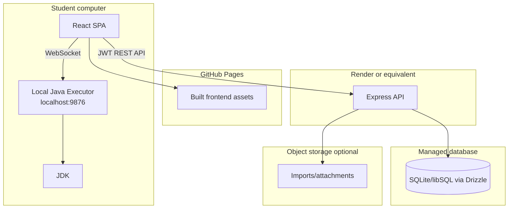
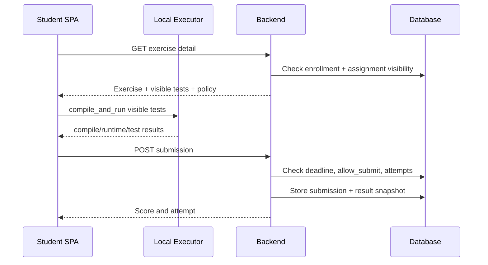
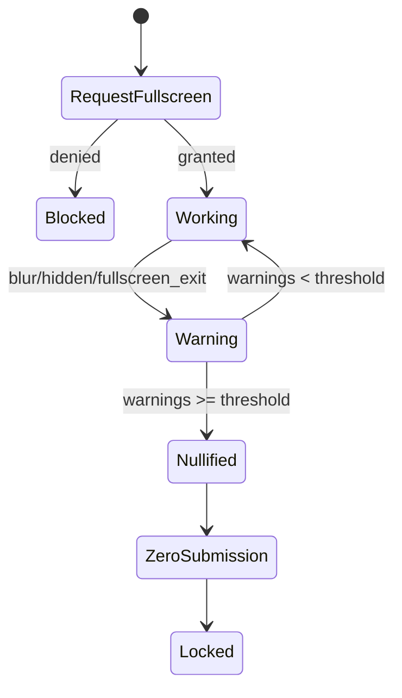

# Design Document

## Purpose

This design describes an OASIS-like OOP practice platform for UET. The system must feel and behave like an operational teaching assistant system: course sections first, weekly practice work second, submissions/ranking/review always visible to instructors, and a compact table-driven interface. It also adds local Java execution and anti-cheat assessment mode for modern AI-assisted learning conditions.

The design intentionally avoids turning the product into a broad LMS, public course site, or generic online judge.

## Product Shape

### Core OASIS Concepts

The original OASIS public application identifies itself as "UET OASIS - OOP Assistant System" and "He thong ho tro giang day thuc hanh Lap trinh huong doi tuong". Public bundle strings expose these core concepts:

- Course section list: "CAC LOP HOC PHAN".
- Course ranking endpoints and ranking pages.
- Weekly exercise grouping: "TUAN".
- Deadline display: "Han nop".
- Exercise controls: max submit count, allow submit, show exercise, choose exercise.

The new platform should center its information architecture around those concepts.

### Primary Navigation

Admin:
- Dashboard
- Lop hoc phan
- Import/export sinh vien
- Quan ly giang vien
- Quan ly sinh vien
- Thu vien bai tap
- Cau hinh he thong
- Quota/trang thai dich vu

Instructor:
- Lop hoc phan cua toi
- Phan bai theo tuan
- Quan ly bai tap
- Test cases
- Bai nop/cham bai
- Bang xep hang
- Kiem tra ma nguon

Student:
- Lop hoc phan/bai tap
- Workspace lam bai
- Lich su nop bai
- Tien do
- Bang xep hang

## Architecture



### Architectural Rules

1. Course section is the top-level teaching unit for almost every feature.
2. Exercise assignment is distinct from exercise content. Visibility, deadline, week, max submit count, and assessment mode belong to the assignment.
3. Submissions are append-only attempts.
4. Submission results are snapshots and do not change when test cases are later edited.
5. Ranking is computed from best score per assignment, not raw attempt sum.
6. Local execution is for student feedback and classroom scalability; the backend still stores authoritative submission records and scores based on submitted test results/expected outputs.
7. Anti-cheat is tied to assessment assignments and produces audit events plus zero-score nullification.

## Current Technology Baseline

Frontend:
- React + TypeScript + Vite
- React Router
- Zustand
- Tailwind CSS
- Monaco Editor
- Axios

Backend:
- Node.js 20
- Express
- Drizzle ORM
- SQLite/libSQL compatible schema
- Zod validation
- JWT + bcrypt
- Vitest/Supertest

Local executor:
- Java/Gradle project
- WebSocket server on `ws://localhost:9876`
- Uses local `javac` and `java`

Deployment:
- GitHub Actions
- Frontend deploys to GitHub Pages on `main` changes under `frontend/**`
- Backend workflow builds/tests and calls Render deploy hook on `main` changes under `backend/**`

## Domain Model

### Users

Fields:
- id
- username
- email
- password_hash
- role: student, instructor, admin
- full_name
- must_change_password
- failed_login_attempts
- locked_until
- timestamps

Notes:
- Student ID should be represented either by username or a dedicated student_external_id on enrollment.
- Instructor display name should use full_name where available.

### Course Sections

Fields:
- id
- name
- semester
- instructor_id
- status: active/archive, if implemented
- created_at

Relationships:
- Has many enrollments.
- Has many exercise assignments.
- Has many weekly schedule rows.
- Has many submissions through assignments.

### Section Enrollments

Fields:
- id
- section_id
- student_id
- student_external_id
- enrolled_at

Rules:
- Unique section_id + student_id.
- student_external_id stores MSSV/imported student code for display/export.

### Exercises

Fields:
- id
- title
- description
- difficulty
- starter_code
- is_library
- oop_tags JSON
- created_by
- timestamps

Rules:
- Exercise content can be reused.
- Assignments decide where/when/how it is used.

### Exercise Assignments

Fields:
- id
- exercise_id
- section_id
- week
- deadline
- is_assessment
- is_visible
- allow_submit
- max_submissions_override
- assigned_at

Current schema already includes week and is_assessment. Add `is_visible`, `allow_submit`, and `max_submissions_override` when implementing full OASIS parity.

### Section Weeks

Fields:
- id
- section_id
- week
- deadline

Rules:
- Default weeks: 1 to 15.
- Week deadline is inherited by assignments unless assignment deadline overrides it.

### Test Cases

Fields:
- id
- exercise_id
- input_data
- expected_output
- is_visible
- point_value
- time_limit_seconds
- created_at

Rules:
- Hidden tests are scoring-only.
- Historical submission results keep old outcomes.

### Submissions

Fields:
- id
- student_id
- exercise_id
- section_id
- code
- score
- manual_score
- feedback
- attempt_number
- submitted_at

Rules:
- Append-only for attempts.
- manual_score overrides display/export if set, but automatic score remains visible.

### Submission Results

Fields:
- id
- submission_id
- test_case_id
- passed
- actual_output
- status
- execution_time_ms

Rules:
- Stores grading snapshot for every test in that submission.

### Anti-Cheat Events

Fields:
- id
- submission_id nullable
- student_id
- exercise_id
- event_type
- warning_count_at_event
- occurred_at

Rules:
- Instructor sees event log on submission detail.
- Threshold reached creates or marks a zero-score submission for the assessment.

### System Config

Keys:
- warning_threshold: 1-10, default 3
- time_limit: 1-180 minutes or equivalent executor setting
- max_submissions: 1-100
- default_week_count: default 15
- optional default deadline policy

## Backend API Design

Endpoint names should follow the existing codebase where already implemented. New endpoints should be added only where gaps exist.

### Auth

| Method | Endpoint | Purpose |
| --- | --- | --- |
| POST | `/api/auth/login` | Login |
| POST | `/api/auth/refresh` | Refresh token |
| POST | `/api/auth/logout` | Logout |
| POST | `/api/auth/change-password` | Change required password |

### Admin Sections and Roster

| Method | Endpoint | Purpose |
| --- | --- | --- |
| GET | `/api/admin/sections` | List sections |
| POST | `/api/admin/sections` | Create section |
| GET | `/api/admin/sections/:id` | Section detail |
| PUT | `/api/admin/sections/:id` | Update section |
| DELETE | `/api/admin/sections/:id` | Delete/archive section |
| POST | `/api/admin/sections/:id/import-students` | Import roster |
| GET | `/api/admin/sections/:id/export-students` | Export roster |
| PUT | `/api/admin/sections/:id/instructor` | Assign instructor |

### Section Schedule

Use both Admin and Instructor route prefixes, enforcing permissions:

| Method | Endpoint | Purpose |
| --- | --- | --- |
| GET | `/api/{role}/sections/:id/schedule` | Get 15-week schedule, unscheduled exercises, pool |
| POST | `/api/{role}/sections/:id/schedule/assign` | Assign exercise to week |
| POST | `/api/{role}/sections/:id/schedule/unassign` | Remove exercise from week |
| PUT | `/api/{role}/sections/:id/schedule/deadline` | Set week deadline |
| PUT | `/api/{role}/sections/:id/assignments/:assignmentId` | Update visibility, allow submit, max submit, assessment |

### Exercises and Library

| Method | Endpoint | Purpose |
| --- | --- | --- |
| GET | `/api/exercises` | Instructor exercise list |
| POST | `/api/exercises` | Create exercise |
| GET | `/api/exercises/library` | Browse library |
| POST | `/api/exercises/:id/clone` | Clone library/custom exercise |
| PUT | `/api/exercises/:id` | Update exercise |
| DELETE | `/api/exercises/:id` | Delete/archive exercise |
| POST | `/api/exercises/:id/assign` | Assign to section |

Admin may use `/api/admin/exercises` for global library management.

### Test Cases

| Method | Endpoint | Purpose |
| --- | --- | --- |
| GET | `/api/exercises/:exerciseId/testcases` | List test cases |
| POST | `/api/exercises/:exerciseId/testcases` | Create test case |
| PUT | `/api/testcases/:id` | Update test case |
| DELETE | `/api/testcases/:id` | Delete test case |

### Student

| Method | Endpoint | Purpose |
| --- | --- | --- |
| GET | `/api/students/sections` | My sections |
| GET | `/api/students/exercises` | My visible assignments |
| GET | `/api/students/exercises/:id` | Workspace details |
| POST | `/api/submissions` | Submit solution |
| GET | `/api/submissions` | My submissions |
| GET | `/api/submissions/:id` | My submission detail |
| GET | `/api/students/progress` | Progress for section |

Student exercise endpoints must account for assignment visibility, allow_submit, deadline, week, and max submissions.

### Instructor Review

| Method | Endpoint | Purpose |
| --- | --- | --- |
| GET | `/api/submissions` | Instructor filtered submission list |
| GET | `/api/submissions/:id` | Instructor submission detail |
| PUT | `/api/submissions/:id/review` | Feedback/manual score |
| GET | `/api/submissions/:id/anticheat-log` | Anti-cheat events |
| GET | `/api/sections/:id/leaderboard` | Course ranking |
| GET | `/api/sections/:id/leaderboard/export` | Export ranking |
| POST | `/api/sections/:id/plagiarism` | Run similarity check |
| GET | `/api/sections/:id/plagiarism` | List reports/results |

### Admin Config and Status

| Method | Endpoint | Purpose |
| --- | --- | --- |
| GET | `/api/admin/config` | List config |
| PUT | `/api/admin/config` | Update config |
| GET | `/api/admin/quota-status` | Service quota/status |

## Frontend Page Design

### Login

Purpose:
- Fast role-based entry.
- UET/OASIS branding.
- No public marketing content.

States:
- invalid credential
- account locked
- expired session
- forced password change

### Admin Dashboard

Content:
- Section count
- Student count
- Instructor count
- Submission count
- Recent import/deploy/quota warnings

### Admin Sections

List:
- name
- semester
- instructor
- student count
- assigned exercise count
- status
- actions

Detail tabs:
- Roster
- Schedule
- Exercises
- Ranking
- Imports/exports

### Student Import

Flow:
1. Choose section.
2. Upload CSV/XLS/XLSX.
3. Preview detected columns.
4. Confirm import.
5. Show report with imported/skipped/duplicates/errors.
6. Export report if needed.

### Weekly Schedule Page

Layout:
- Left: weeks 1-15 as dense lanes/cards.
- Right: exercise pool/library search.
- Each week shows deadline and assigned exercises.
- Each assignment shows visible state, allow submit state, assessment badge, max submissions.

Interactions:
- Drag/drop or action menu to assign exercise to week.
- Save week deadline.
- Edit assignment settings.
- Remove from week.

### Instructor Exercise Manager

Views:
- My exercises
- Library
- Create/edit
- Test cases

Exercise form:
- title
- difficulty
- tags
- description
- starter code
- library flag if Admin

### Submission Review

Filters:
- section
- week
- exercise
- student
- score range
- attempt
- assessment/anti-cheat status

Detail:
- source code
- compile/run results
- test result table
- score and manual score
- feedback
- anti-cheat event table
- plagiarism links

### Ranking

Course ranking table:
- rank
- student ID
- student name
- total score
- completed assignments
- last/earliest relevant submission time
- per-assignment score columns when useful

Behavior:
- Filter by section.
- Export CSV/XLSX.
- Refresh after submissions.

### Student Exercise List

Group by:
- section
- week

Columns:
- title
- topic tags
- deadline
- status
- best score
- attempts/max attempts
- assessment badge

### Student Workspace

Panels:
- Exercise statement
- Visible test cases
- Code editor
- Local run output
- Submit result
- Anti-cheat warning badge when assessment

Rules:
- For assessment, fullscreen monitor wraps the workspace.
- If local executor cannot connect, show setup instructions.
- Submission button disabled when not allowed, overdue, max attempts reached, or session nullified.

### Student History and Progress

History:
- Group by exercise.
- Attempts sorted newest first.
- Link to detail.

Progress:
- Section selector.
- completed count
- average score
- rank
- best scores
- missing work

## Key Workflows

### OASIS-Style Weekly Assignment

1. Instructor opens course section.
2. Instructor opens weekly schedule.
3. Instructor selects exercise from library or custom pool.
4. Instructor assigns it to week.
5. Instructor sets deadline, visible, allow_submit, max submissions, assessment flag.
6. Student sees it under the matching week only when visible.
7. Student submits only when allow_submit and other policies pass.
8. Ranking uses the student's best score for that assignment.

### Student Submission



### Assessment Nullification



### Plagiarism Review

1. Instructor selects section and exercise.
2. Backend loads latest/best submissions.
3. Service normalizes code and removes known starter code where possible.
4. Similarity pairs are computed.
5. Instructor sees suspicious pairs and opens side-by-side comparison.
6. Instructor decides whether to adjust manual score or feedback.

## Ranking Design

For each assignment in a section:
- Choose each student's highest score.
- If manual_score exists and policy says manual overrides, use manual_score for ranking display/export.
- Sum scores across assignments.
- Completed count is number of assignments with best score > 0.
- Tie break:
  1. Higher total score.
  2. More completed assignments.
  3. Earlier timestamp for the submissions contributing to best scores.
  4. Student external ID.

## Validation Rules

### Exercise

- title required, max 200 chars
- description required
- difficulty one of easy/medium/hard
- 1 to 5 OOP tags recommended
- starter code optional

### Assignment

- section and exercise required
- week 1 to configured default_week_count
- max submissions 1 to 100
- visible and allow_submit booleans
- assessment boolean
- deadline optional but recommended

### Test Case

- 1 to 50 per exercise
- input max 10KB
- expected output max 10KB
- point value 1 to 100
- time limit positive when set

### Config

- warning_threshold: 1 to 10
- time_limit: 1 to 180
- max_submissions: 1 to 100
- default_week_count: 1 to 30, default 15

## Security and Permissions

1. JWT is required for all protected routes.
2. Role guard protects Admin, Instructor, Student areas.
3. Section access is checked by ownership/enrollment:
   - Student must be enrolled.
   - Instructor must be assigned.
   - Admin can access all.
4. Roster import must not expose generated passwords in logs.
5. Credential files must never be committed.
6. Source code submissions are visible only to the student owner, assigned instructor, and admin.
7. Plagiarism reports are instructor/admin only.
8. Anti-cheat logs are instructor/admin only, except student warning count shown during assessment.

## Error Handling

Standard response:

```json
{
  "error": {
    "code": "VALIDATION_ERROR",
    "message": "Human-readable message",
    "details": []
  }
}
```

Important cases:
- `UNAUTHENTICATED`: login required
- `FORBIDDEN`: role/section access denied
- `NOT_FOUND`: missing or inaccessible entity
- `DEADLINE_PASSED`: submission rejected
- `SUBMISSION_DISABLED`: allow_submit is false
- `MAX_SUBMISSIONS_REACHED`: attempt limit reached
- `ASSESSMENT_NULLIFIED`: score is zero due to anti-cheat
- `LOCAL_EXECUTOR_UNAVAILABLE`: browser cannot connect to local agent

## Deployment Design

### GitHub Actions

Frontend workflow:
- Trigger: push to `main` affecting `frontend/**`
- Install dependencies
- Build frontend
- Upload GitHub Pages artifact
- Deploy Pages

Backend workflow:
- Trigger: push to `main` affecting `backend/**`
- Install dependencies
- Build backend
- Run backend tests
- Call Render deploy hook when `RENDER_DEPLOY_HOOK_URL` is configured

### Environment Variables

Backend:
- database URL/token
- JWT secret
- CORS origin
- optional storage credentials
- Render deploy hook stored only in GitHub secrets

Frontend:
- API base URL
- app base path for GitHub Pages

### Deployment Constraints

- Do not commit `.env`, credential files, student credential samples, or generated secrets.
- Database migrations must be explicit and reviewed.
- Frontend must support GitHub Pages base path.
- Backend health endpoint must be available for deployment checks.

## Testing Strategy

Backend:
- auth and role guard tests
- section and roster import/export tests
- schedule assignment tests
- exercise/test case tests
- submission scoring tests
- deadline/max submission tests
- anti-cheat nullification tests
- leaderboard ordering tests
- plagiarism service tests

Frontend:
- auth routing tests
- schedule page interaction tests
- workspace/local executor hook tests
- anti-cheat monitor tests
- submission/history/progress rendering tests
- admin import/config form tests

Manual smoke after deploy:
1. Login as admin, instructor, student.
2. Create or open a section.
3. Import roster.
4. Assign exercise to a week.
5. Toggle visible/allow submit.
6. Submit as student.
7. Confirm instructor sees submission and ranking.
8. Confirm assessment anti-cheat can record zero score.

