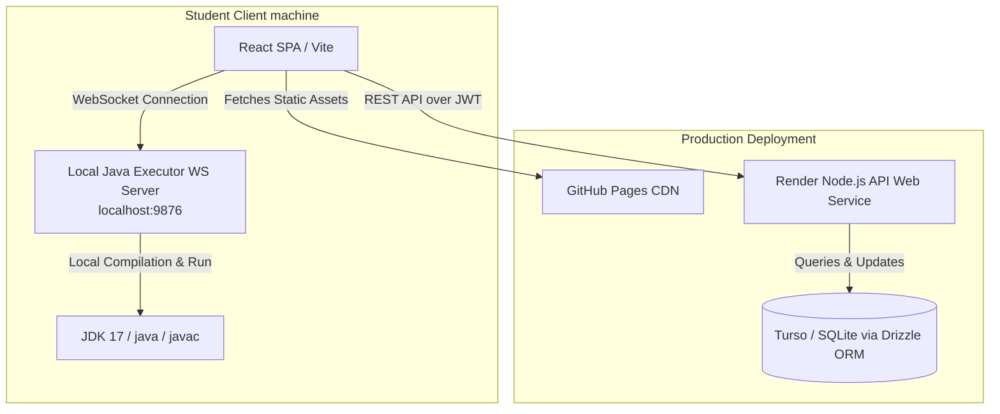
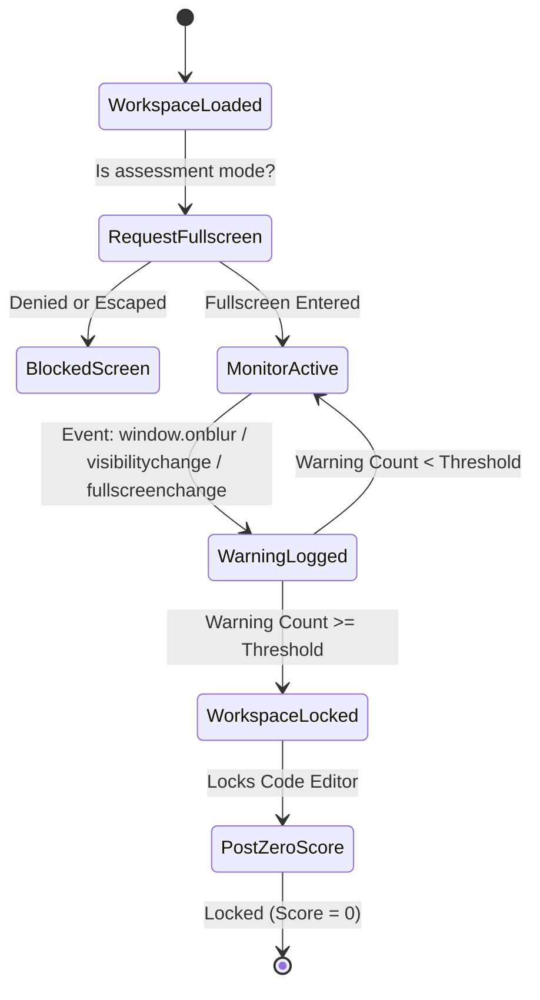

# Design Document: OOP Learning Platform (UET OASIS Parity)

## 1. Purpose & Product Shape

This design specification describes the architecture, data schemas, API contracts, and user interface workflows for the OOP Learning Platform. The platform replicates the workflows of the original **UET OASIS** system (oasis.uet.vnu.edu.vn) for Java Object-Oriented Programming practice, optimized with student-side local execution and anti-cheat exam sessions.

### Core OASIS User Interfaces & Workflows
The platform implements a dense, table-driven administrative and workspace UI based on the original OASIS platform:
- **`/#/dashboard`:** Displays semesters containing enrolled or managed course sections (`CÁC LỚP HỌC PHẦN`) alongside a sidebar leaderboard.
- **`/#/course/:id`:** Organizes exercises under weekly lanes (`TUẦN 1` through `TUẦN 15`) with submission indicators and visibility checkmarks.
- **`/#/teacher/pickproblem/:id`:** Split lanes enabling deadlines setup per week (left) and assigning problems from the exercise library (right).
- **`/#/submissions`:** Full list of submissions with sub-header text filters for each column.
- **`/#/submissions_detail/:id`:** Left panel with metadata and status. Right panel containing manual grade checkboxes (SE/PE/CE), code editor read-only view, functional results breakdown, and terminal logs.
- **`/#/ranking`:** A grid-based class standings sheet, highlighting scores for each exercise across student rows.

---

## 2. Architecture & Data Flow



### Architectural Rules
1. **Course Section Centric:** Almost all endpoints and frontend views are parameterized by a `course_id`. Access control is validated against course enrollment/assignment.
2. **Assignments vs. Exercises:** An `Exercise` is a reusable library entity. An `Assignment` binds an `Exercise` to a `Course Section` for a specific `Week`, setting a `deadline`, `visibility`, `submission permissions`, and `assessment mode`.
3. **Single Student Section:** A Student account has exactly one active enrollment. Student pages resolve the current section from that enrollment and do not show section-switching controls.
4. **Local Code Execution:** Student code compiles and runs locally on their computer using the `Local Executor` WebSocket agent, protecting the backend server from compiling untrusted Java code. The final score evaluation is authoritative on the backend.
5. **Immutable Runs:** Once submitted, a submission's code, attempt counter, score, and test outcomes are archived immutably.
6. **Anti-Cheat Monitoring:** Enabled exclusively for assignments marked as `assessment`. A student’s warning events (fullscreen exits, tab shifts, window blurs) are written to the database. Reaching the warning threshold locks the assessment workspace and registers a 0-score attempt.

---

## 3. Database Schema Design (SQLite / Drizzle)

The database schema utilizes standard SQLite fields mapped with Drizzle ORM.

### 3.1 Users (`users`)
Stores Admin, Instructor, and Student accounts.
* `id`: `text` (UUID), primary key.
* `username`: `text`, unique, indexed (used for logging in - Student Code or Instructor shortname).
* `email`: `text`, unique.
* `password_hash`: `text`.
* `role`: `text` (enum: `'student'`, `'instructor'`, `'admin'`).
* `full_name`: `text`.
* `must_change_password`: `integer` (boolean, default 0).
* `failed_login_attempts`: `integer` (default 0).
* `locked_until`: `text` (ISO Timestamp, nullable).
* `created_at`: `text` (ISO Timestamp).
* `updated_at`: `text` (ISO Timestamp).

### 3.2 Course Sections (`sections`)
Course groups managed by one or more instructors.
* `id`: `text` (UUID), primary key.
* `name`: `text` (e.g. `OOP Lớp INT2204 8`).
* `semester`: `text` (e.g. `Học kỳ I năm học 2025-2026`).
* `instructor_id`: `text`, nullable foreign key to `users(id)`. This remains the primary/legacy instructor pointer for backward compatibility.
* `created_at`: `text` (ISO Timestamp).

### 3.2.1 Section Instructors (`section_instructors`)
Many-to-many assignment table that allows multiple instructors to co-teach the same section.
* `id`: `text` (UUID), primary key.
* `section_id`: `text`, foreign key to `sections(id)`, indexed.
* `instructor_id`: `text`, foreign key to `users(id)`, indexed.
* `is_primary`: `integer` (boolean, default 0). The primary instructor is mirrored into `sections.instructor_id`.
* `assigned_at`: `text` (ISO Timestamp).
* *Unique constraint:* `(section_id, instructor_id)`.

### 3.3 Enrollments (`enrollments`)
Enrollment records connecting students to sections.
* `id`: `text` (UUID), primary key.
* `section_id`: `text`, foreign key to `sections(id)`, indexed.
* `student_id`: `text`, foreign key to `users(id)`, indexed.
* `student_external_id`: `text` (MSSV code, e.g. `20021287`).
* `enrolled_at`: `text` (ISO Timestamp).
* *Unique constraint:* `(section_id, student_id)`.
* *Unique constraint:* `(student_id)` to enforce one active class section per student.

Student transfer is modeled as removing or archiving the old enrollment before creating the new one. Roster import must reject a student who already has an enrollment in another active section.

### 3.4 Exercises (`exercises`)
Shared library or custom programming problems.
* `id`: `text` (UUID), primary key.
* `title`: `text`.
* `description`: `text` (Markdown content).
* `difficulty`: `text` (enum: `'easy'`, `'medium'`, `'hard'`).
* `starter_code`: `text` (Java boilerplate).
* `oop_tags`: `text` (JSON array of strings).
* `is_library`: `integer` (boolean, default 0).
* `created_by`: `text`, foreign key to `users(id)`.
* `created_at`: `text` (ISO Timestamp).

### 3.5 Test Cases (`test_cases`)
Inputs and expectations associated with exercises.
* `id`: `text` (UUID), primary key.
* `exercise_id`: `text`, foreign key to `exercises(id)`, cascade delete.
* `input_data`: `text`.
* `expected_output`: `text`.
* `is_visible`: `integer` (boolean, default 1).
* `point_value`: `integer` (default 10).
* `time_limit_ms`: `integer` (default 5000).

### 3.6 Assignments (`assignments`)
Links an exercise to a section for a specific week.
* `id`: `text` (UUID), primary key.
* `section_id`: `text`, foreign key to `sections(id)`, cascade delete.
* `exercise_id`: `text`, foreign key to `exercises(id)`, cascade delete.
* `week`: `integer` (1 to 15).
* `deadline`: `text` (ISO Timestamp, nullable).
* `is_visible`: `integer` (boolean, default 1).
* `allow_submit`: `integer` (boolean, default 1).
* `is_assessment`: `integer` (boolean, default 0).
* `max_submissions`: `integer` (default 10).
* *Unique constraint:* `(section_id, exercise_id)`.

### 3.7 Submissions (`submissions`)
Students' code submissions.
* `id`: `text` (UUID), primary key.
* `student_id`: `text`, foreign key to `users(id)`.
* `exercise_id`: `text`, foreign key to `exercises(id)`.
* `section_id`: `text`, foreign key to `sections(id)`.
* `code`: `text`.
* `score`: `real` (computed percentage, 0.0 to 100.0).
* `manual_score`: `real` (instructor manual grade, nullable).
* `feedback`: `text` (instructor feedback, nullable).
* `has_se`: `integer` (boolean, Structure Error, default 0).
* `has_pe`: `integer` (boolean, Presentation Error, default 0).
* `has_ce`: `integer` (boolean, Compilation Error, default 0).
* `attempt_number`: `integer`.
* `submitted_at`: `text` (ISO Timestamp).

### 3.8 Submission Results (`submission_results`)
Snapshots of test case runs for historical tracking.
* `id`: `text` (UUID), primary key.
* `submission_id`: `text`, foreign key to `submissions(id)`, cascade delete.
* `test_case_id`: `text`, foreign key to `test_cases(id)`.
* `passed`: `integer` (boolean).
* `actual_output`: `text` (nullable).
* `status`: `text` (enum: `'passed'`, `'failed'`, `'timeout'`, `'error'`).
* `execution_time_ms`: `integer`.

### 3.8.1 Major Project Groups (`project_groups`)
Group submissions for large project assignments such as Arkanoid.
* `id`: `text` (UUID), primary key.
* `section_id`: `text`, foreign key to `sections(id)`.
* `exercise_id`: `text`, foreign key to `exercises(id)`.
* `name`: `text`.
* `repository_url`: `text` (nullable GitHub URL).
* `score`: `real` (nullable 0-100 group grade).
* `feedback`: `text` (nullable instructor feedback).
* `status`: `text` enum (`draft`, `submitted`, `graded`).
* `created_at`, `updated_at`, `graded_at`: ISO timestamps.
* `graded_by`: `text`, foreign key to `users(id)`.
* *Unique constraint:* `(section_id, exercise_id, name)`.

### 3.8.2 Major Project Group Members (`project_group_members`)
Membership and contribution split for a project group.
* `id`: `text` (UUID), primary key.
* `group_id`: `text`, foreign key to `project_groups(id)`.
* `student_id`: `text`, nullable foreign key to `users(id)`.
* `student_external_id`: `text` (MSSV).
* `student_name`: `text`.
* `is_leader`: `integer` (boolean).
* `contribution_percent`: `integer` (0-100).
* `created_at`: ISO timestamp.
* *Unique constraint:* `(group_id, student_external_id)`.

### 3.9 Anti-Cheat Events (`anticheat_events`)
Tracks exam violations during assessments.
* `id`: `text` (UUID), primary key.
* `student_id`: `text`, foreign key to `users(id)`, indexed.
* `exercise_id`: `text`, foreign key to `exercises(id)`.
* `section_id`: `text`, foreign key to `sections(id)`.
* `event_type`: `text` (enum: `'fullscreen_exit'`, `'visibility_hidden'`, `'window_blur'`).
* `warning_count_at_event`: `integer`.
* `occurred_at`: `text` (ISO Timestamp).

### 3.10 System Configurations (`system_config`)
Global setup variables.
* `key`: `text`, primary key.
* `value`: `text`.
*(Pre-seeded keys: `'warning_threshold'`, `'time_limit'`, `'max_submissions'`, `'source_check_enabled'`, `'source_check_weekly_enabled'`, `'source_check_provider'`, `'source_check_similarity_threshold'`, `'source_check_max_runtime_minutes'`)*

### 3.11 Source Check Jobs (`source_check_jobs`)
Tracks manual and GitHub Actions source-similarity runs.
* `id`: `text` (UUID), primary key.
* `exercise_id`: `text`, foreign key to `exercises(id)`.
* `section_id`: `text`, nullable foreign key to `class_sections(id)`.
* `provider`: `text` (enum: `'jplag'`, `'pmd_cpd'`, `'dolos'`).
* `threshold`: `integer` percentage.
* `trigger`: `text` (enum: `'manual'`, `'weekly_schedule'`, `'workflow_dispatch'`).
* `status`: `text` (enum: `'queued'`, `'running'`, `'completed'`, `'failed'`, `'skipped'`).
* `artifact_url`: `text`, nullable.
* `summary_json`: `text`, nullable JSON summary.
* `started_at`: `text`, nullable ISO timestamp.
* `completed_at`: `text`, nullable ISO timestamp.

### 3.12 Source Check Pairs (`source_check_pairs`)
Stores suspicious pairs found by a source check run.
* `id`: `text` (UUID), primary key.
* `job_id`: `text`, foreign key to `source_check_jobs(id)`.
* `submission_a_id`: `text`, foreign key to `submissions(id)`.
* `submission_b_id`: `text`, foreign key to `submissions(id)`.
* `similarity`: `real`.
* `review_status`: `text` (enum: `'new'`, `'reviewed'`, `'false_positive'`, `'confirmed'`).

---

## 4. Backend REST API Contracts

### 4.1 Authentication Endpoints
* **`POST /api/auth/login`**
  - Request: `{ "username": "20021287", "password": "..." }`
  - Response: `{ "token": "JWT_TOKEN", "user": { "id": "...", "username": "20021287", "role": "student", "fullName": "Lê Hải Anh" } }`
* **`POST /api/auth/change-password`**
  - Request: `{ "oldPassword": "...", "newPassword": "..." }`
  - Response: `{ "message": "Đổi mật khẩu thành công" }`

### 4.2 Class Section Management (Admin / Instructor)
* **`GET /api/admin/sections`**
  - Response: `[{ "id": "...", "name": "OOP Lớp INT2204 8", "semester": "...", "instructors": [{ "id": "...", "fullName": "Kiều Văn Tuyên", "isPrimary": true }] }]`
* **`POST /api/admin/sections`**
  - Request: `{ "name": "...", "semester": "...", "instructor_ids": ["...", "..."] }`
  - Response: Created section object.
* **`POST /api/admin/sections/:id/import-students`**
  - Request: `multipart/form-data` with roster sheet.
  - Response: `{ "imported": 45, "skipped": 2, "details": ["Dòng 5: Trùng mã sinh viên hoặc đã thuộc lớp khác", "Dòng 12: Thiếu email"] }`
* **`GET /api/admin/sections/:id/export-students`**
  - Response: Excel file attachment containing roster lists and attempt statistics.
* **`POST /api/instructor/sections/:id/students`** (Add Student Custom)
  - Request: `{ "studentId": "20021287", "fullName": "...", "email": "..." }`
* **`DELETE /api/instructor/sections/:id/students/:studentId`** (Remove Student)

### 4.3 Assignment & Week Scheduling
* **`GET /api/instructor/sections/:id/assignments`**
  - Response: Full 15-week list with assigned exercises, deadlines, visibility flags.
* **`POST /api/instructor/sections/:id/assignments`** (Assign Exercise)
  - Request: `{ "exerciseId": "...", "week": 3, "deadline": "...", "isAssessment": true }`
* **`DELETE /api/instructor/sections/:id/assignments/:assignmentId`** (Unassign Exercise)
* **`PATCH /api/instructor/sections/:id/assignments/:assignmentId`** (Update settings)
  - Request: `{ "is_visible": true, "allow_submit": false, "max_submissions": 5 }`

### 4.4 Submissions & Grading
* **`GET /api/submissions`** (Instructor submissions log)
  - Query parameters: `exercise_id`, `student_name`, `score_min`, `score_max`, `page`, `limit`.
  - Response: `[{ "id": "...", "studentName": "...", "exerciseTitle": "...", "score": 85.0, "submittedAt": "..." }]`
* **`GET /api/submissions/:id`** (Submission Review Detail)
  - Response: Detailed object containing the submitted source code, test case evaluations, manual score adjustments, and any logged anti-cheat records.
* **`PATCH /api/submissions/:id/grade`** (Instructor Manual Override)
  - Request: `{ "feedback": "...", "score": 80.0, "hasSe": true, "hasPe": false, "hasCe": false }`
* **`GET /api/submissions/:id/anticheat-log`**

### 4.4.1 Major Project / Group Assignment APIs
* **`GET /api/instructor/sections/:sectionId/projects/:exerciseId`**
  - Response: exercise description, group list, enrolled students, statistics, and history.
* **`POST /api/instructor/sections/:sectionId/projects/:exerciseId/groups`**
  - Request: `{ "name": "...", "repository_url": "...", "members": [{ "student_external_id": "24020010", "is_leader": true, "contribution_percent": 50 }] }`
* **`PUT /api/instructor/sections/:sectionId/projects/:exerciseId/groups/:groupId`**
  - Updates group metadata, repository URL, and member list.
* **`PATCH /api/instructor/sections/:sectionId/projects/:exerciseId/groups/:groupId/grade`**
  - Request: `{ "score": 95, "feedback": "..." }`
* **`DELETE /api/instructor/sections/:sectionId/projects/:exerciseId/groups/:groupId`**

### 4.5 Source Check / Plagiarism
* **`GET /api/source-check/settings`**
  - Response: Global admin toggles plus instructor-visible provider/threshold defaults.
* **`PUT /api/source-check/settings`** (Admin)
  - Request: `{ "enabled": true, "weeklyEnabled": false, "provider": "jplag", "threshold": 70, "maxRuntimeMinutes": 20 }`
* **`POST /api/source-check/jobs`** (Instructor)
  - Request: `{ "exerciseId": "...", "sectionId": "...", "trigger": "manual" }`
  - Response: Created job metadata.
* **`GET /api/source-check/jobs/due`** (GitHub Actions token)
  - Response: Due section/exercise jobs. Returns an empty list when admin toggles are off.
* **`POST /api/source-check/jobs/:id/complete`** (GitHub Actions token)
  - Request: `{ "status": "completed", "artifactUrl": "...", "summary": { "pairs": 4 } }`
* **`GET /api/source-check/reports`**
  - Query parameters: `exercise_id`, `section_id`, `status`, `page`, `limit`.
  - Response: List of anti-cheat logs logged during the submission window.

---

## 5. Local Code Executor Protocol (WebSocket)

When students compile and run their Java files, the frontend establishes a connection to the local daemon:
- **WebSocket URL:** `ws://localhost:9876`

### 5.1 Compilation and Execution Request (Client to Executor)
```json
{
  "type": "compile_and_run",
  "code": "public class Main {\n  public static void main(String[] args) {\n    System.out.println(\"Hello World\");\n  }\n}",
  "testCases": [
    { "id": "tc-1", "input": "", "expectedOutput": "Hello World" }
  ],
  "timeoutSeconds": 5
}
```

### 5.2 Success Response (Executor to Client)
```json
{
  "type": "result",
  "compiled": true,
  "testResults": [
    {
      "id": "tc-1",
      "passed": true,
      "status": "passed",
      "actualOutput": "Hello World\n",
      "executionTimeMs": 142
    }
  ]
}
```

### 5.3 Compilation Failure Response (Executor to Client)
```json
{
  "type": "result",
  "compiled": false,
  "errors": [
    {
      "line": 3,
      "message": "';' expected"
    }
  ]
}
```

---

## 6. Anti-Cheating Event Flow & Monitoring



### Event Listeners (React hook: `useAntiCheat.ts`)
- **Fullscreen exit:** Listens to `fullscreenchange`. If `document.fullscreenElement` is null, trigger a warning.
- **Tab Switched:** Listens to `visibilitychange`. If `document.visibilityState === 'hidden'`, trigger a warning.
- **Lost Focus:** Listens to window `blur` events. If the student selects another window, trigger a warning.
- **Warning Threshold Handler:** Upon warning trigger, the count increments. When it equals `warning_threshold`, the front-end hits `POST /api/submissions/nullify` with the zero-score payload, locking the UI with an overlay message.
