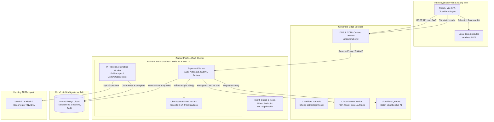

# ADR-005: Chuyển đổi Backend API từ Render sang Zeabur (Free Plan)

- **Trạng thái:** Được chấp thuận làm phương án mục tiêu; chưa hoàn tất cutover.
- **Ngày cập nhật:** 04/09/2026.
- **Phạm vi:** Hosting backend Node.js/Express API, môi trường Java/Checkstyle runner, cơ chế CI/CD, chiến lược xử lý cold-start / auto-sleep, và tích hợp mạng trong kiến trúc Hybrid Cloudflare của OOP Learning Platform.

---

## 1. Tóm tắt quyết định

Hệ thống quyết định di chuyển **Node.js/Express Transactional API** từ **Render (Free Plan)** sang **Zeabur (Free Plan)**:

| Thành phần | Trước khi chuyển đổi (Render Free) | Mục tiêu sau canary Zeabur | Tiêu chí chấp thuận |
|---|---|---|---|
| **Vị trí địa lý (Region)** | Đo latency thực tế hiện tại trước rollout. | Chọn region APAC gần UET nhất mà dashboard cho phép. | Đo p50/p95/p99 từ mạng mục tiêu, không dùng con số ước tính. |
| **Auto-sleep & cold start** | Render là baseline rollback. | Free Plan vẫn auto-sleep và không có SLA. | Pre-warm, first-request và luồng submit đạt SLO canary đã ghi nhận. |
| **Build/runtime resource** | Có thể OOM ở môi trường cũ. | Docker multi-stage đóng gói Node 22 + JRE 17. | Build thành công và runtime resource/quota được đọc từ dashboard. |
| **Java/Checkstyle** | Có thể tải JRE/JAR lúc start. | JRE/JAR có sẵn trong image; runtime cấm download. | Checkstyle chạy được ngay sau healthcheck, không cần outbound download. |
| **Chi phí/độ tin cậy** | Nền tảng miễn phí có giới hạn. | Chỉ dùng Free Plan sau khi xác minh điều kiện tài khoản/quota. | Không coi $0, latency hoặc availability là cam kết cho ca thi thật. |

---

## 2. Bối cảnh và động lực chuyển đổi

OOP Learning Platform ban đầu sử dụng Render Free Web Service làm nơi chạy Backend API giao dịch (kết nối Turso libSQL, Cloudflare R2, và phục vụ client React SPA). Trong quá trình vận hành và chuẩn bị cho các đợt thi/đánh giá lớn, Render Free bộc lộ 4 điểm nghẽn nghiêm trọng:

1. **Độ trễ và cold start cần được đo:** mọi số liệu Render/Zeabur trong ticket là
   baseline đo được, không phải giả định theo vị trí nhà cung cấp.
2. **Free Plan không phải production SLA:** Zeabur công bố auto-sleep và không
   có SLA trên Free Plan; ca thi cần pre-warm, observability và rollback đã thử.
3. **Build phải tái lập:** monorepo có một root lockfile, vì vậy image phải build
   từ repository root thay vì tạo lockfile thứ hai trong `backend/`.
4. **Không tải runtime khi cold start:** Java/Checkstyle phải là artifact image,
   không là dependency mạng của request đầu tiên.

Zeabur hỗ trợ Git integration, Dockerfile và custom health check. Region, điều
kiện xác minh tài khoản và resource phải được xác nhận trong dashboard khi tạo
service; chúng thay đổi theo plan/thời điểm.

---

## 3. Kiến trúc hệ thống sau khi chuyển đổi



---

## 4. Phân tích kỹ thuật & Các biện pháp xử lý đặc thù

### 4.1 Cơ chế Auto-Sleep trên Zeabur Free và Chiến lược Keep-Warm

#### Bản chất Auto-Sleep của Zeabur:
Free Plan tự đưa service idle vào trạng thái sleep và không có SLA. Lần request
đầu có thể chịu cold-start; không ghi một thời lượng hay mức availability cố định
vào thiết kế. `/api/health` chỉ trả 200 sau migration và compatibility DB hoàn tất.

#### Chiến lược Keep-Warm trong các ca thi (Assessment Sessions):
Trong kỳ thi thực tế, không thể chấp nhận rủi ro sinh viên gặp độ trễ cold start hoặc bị nghẽn lúc đồng loạt nhấn nộp bài. Giải pháp được áp dụng:

1. **Pre-warm trước ca thi 15 phút:** gọi HTTPS `/api/health`, login canary và
   kiểm tra DB/R2; ghi kết quả vào log ca thi.
2. **Autosave không là SLA:** traffic người dùng có thể giúp service không idle,
   nhưng không được dùng nó như cam kết giữ ấm hay thay thế pre-warm.
3. **Ping chỉ là dự phòng:** scheduled monitor trong khung thi có thể đánh thức
   service nhưng không thay thế kiểm thử cold-start, giới hạn quota hoặc rollback.

### 4.2 Tối ưu hóa đóng gói: Dockerfile Multi-Stage vs. zbpack

`backend/Dockerfile` build từ repository root để dùng `package-lock.json` của
npm workspaces. `zbpack.json` chọn Dockerfile này cho Zeabur. Builder tải và
kiểm tra Checkstyle JAR trước khi image được tạo; runner chỉ chứa dependency
production, OpenJDK 17 và artifact đã kiểm tra, với auto-download bị tắt.

Không đặt mục tiêu image size hoặc startup time chưa được đo. Container build
thành công trên Zeabur và Checkstyle smoke test mới là tiêu chí 22.1.

### 4.3 Quản lý biến môi trường (Environment Variables)

Toàn bộ các biến môi trường cần được cấu hình trên Dashboard của Zeabur (trong mục Service Settings -> Environment Variables):

| Tên biến | Mục đích | Ví dụ / Giá trị mẫu |
|---|---|---|
| `NODE_ENV` | Môi trường thực thi | `production` |
| `PORT` | Cổng ứng dụng lắng nghe | Zeabur inject; không tự ghi đè trong dashboard |
| `TURSO_DATABASE_URL` | Chuỗi kết nối libSQL | `libsql://your-db.turso.io` |
| `TURSO_AUTH_TOKEN` | Token xác thực Turso | `eyJhbGciOi...` |
| `JWT_SECRET` | Khóa bí mật ký Access Token | Ít nhất 32 ký tự ngẫu nhiên |
| `JWT_REFRESH_SECRET` | Khóa bí mật ký Refresh Token | Ít nhất 32 ký tự ngẫu nhiên |
| `AI_SECRET_ENCRYPTION_KEY` | Khóa mã hóa key AI trong DB | 32 byte hex ngẫu nhiên |
| `CORS_ORIGIN` | Danh sách domain được phép gọi API | `https://uetcodehub.xyz,https://www.uetcodehub.xyz` |
| `CLOUDFLARE_PAGES_PROJECT` | Nhận diện preview domain của Pages | `uetcodehub` |
| `R2_ACCOUNT_ID` | Cloudflare Account ID | `...` |
| `R2_ACCESS_KEY_ID` | S3 Access Key ID cho R2 | `...` |
| `R2_SECRET_ACCESS_KEY` | S3 Secret Access Key cho R2 | `...` |
| `R2_BUCKET_NAME` | Tên R2 Bucket | `oop-platform-artifacts` |
| `PROJECT_REPOSITORY_GITHUB_TOKEN`| Token kiểm tra repo bài tập sinh viên | `ghp_...` |
| `PROJECT_REPOSITORY_REQUIRED_COLLABORATOR` | Username bot kiểm tra cộng tác | `oasis-uet` |
| `CHECKSTYLE_SKIP_JRE_DOWNLOAD` | Bỏ qua bước tải Java tự động | `1` (khi dùng Dockerfile) |
| `CHECKSTYLE_JAVA_BIN` | Đường dẫn Java binary đã cài sẵn | `/usr/bin/java` |
| `CHECKSTYLE_AUTO_DOWNLOAD` | Cấm tải JAR khi runtime | `0` |
| `CHECKSTYLE_AUTO_DOWNLOAD_JRE` | Cấm tải JRE khi runtime | `0` |
| `ASSESSMENT_AI_WORKER_ENABLED` | Bật polling chấm AI trong process | `false` ở canary; chỉ `true` sau cutover |

Toàn bộ provider RPM, `DEPLOYMENT_ENVIRONMENT` và Cloudflare Queue secret được
liệt kê trong `.env.example` và [runbook](zeabur-migration-runbook.md); không
được đưa giá trị secret vào ADR hay GitHub variables công khai.

---

## 5. Quy trình CI/CD & Deploy Automation

### Phương án A (duy nhất trong rollout - Zeabur Native Git Integration):
1. Kết nối Zeabur Project với GitHub Repository `oop-uet/olp`.
2. Để **Root Directory** là repository root, vì `package-lock.json` ở root.
3. Dùng `zbpack.json`/`backend/Dockerfile`; không để Zeabur silent fallback về
   auto-detection Node builder.
4. Bật Watch Paths: `/backend/**`, `/package.json`, `/package-lock.json`,
   `/zbpack.json`, `/.dockerignore`.
5. Mỗi push phù hợp sẽ do Zeabur Git integration deploy. Workflow GitHub
   `Verify Backend for Zeabur` build/test cùng commit, không gọi Render hook hay
   một CLI deploy cạnh tranh, nhưng không phải deployment gate. Muốn gate cứng
   phải dùng protected PR/release process đã được phê duyệt.

Không dùng ví dụ CLI cũ với `--project-id`/`--service-id`: cú pháp CLI thay đổi
theo phiên bản. Nếu sau này cần CI-triggered deploy thay vì Git integration,
thiết kế lại một flow duy nhất theo Zeabur CLI hiện hành, token scoped và
environment/service context đã kiểm thử; không bật song song hai nguồn deploy.

---

## 6. Lộ trình chuyển đổi không gián đoạn (Phased Rollout Plan)

Quá trình chuyển đổi diễn ra theo 5 giai đoạn nghiêm ngặt nhằm bảo đảm hệ thống không bị gián đoạn:

```mermaid
sequenceDiagram
  autonumber
  participant Dev as Kỹ thuật viên
  participant Z as Zeabur Service
  participant CF as Cloudflare DNS/Pages
  participant R as Render (Cũ)
  participant DB as Turso DB

  Note over Dev,Z: Giai đoạn 1: Khởi tạo & Cấu hình
  Dev->>Z: Tạo service, dùng root context + Dockerfile & env vars
  Z->>DB: Kết nối thử Turso & chạy migrate schema
  Dev->>Z: Kiểm tra GET /api/health (200 OK)

  Note over Dev,Z: Giai đoạn 2: Smoke Test & Kiểm thử tải
  Dev->>Z: Kiểm tra luồng Login, Checkstyle, Export PDF
  Dev->>Z: Kiểm thử tải nhẹ mô phỏng 20 người dùng đồng thời

  Note over Dev,CF: Giai đoạn 3: Canary / Dual-hosting
  Dev->>Z: Đặt ASSESSMENT_AI_WORKER_ENABLED=false
  Dev->>CF: Run Pages preview với api_url Zeabur riêng
  Dev->>Z: Thử nghiệm với một bài tập thực hành tuần

  Note over Dev,CF: Giai đoạn 4: Chuyển đổi chính thức (Cutover)
  Dev->>CF: Cập nhật VITE_API_URL sang API Zeabur đã kiểm thử
  CF->>Z: Toàn bộ traffic sinh viên chuyển sang Zeabur
  Dev->>Z: Chỉ sau đó bật AI worker và dừng worker Render

  Note over R: Giai đoạn 5: Giữ Render Standby trong 7 ngày
  Dev->>R: Giữ Render ở chế độ dự phòng; xóa service sau 7 ngày ổn định
```

---

## 7. Ma trận rủi ro & Kế hoạch ứng phó (Risk & Contingency Matrix)

| Rủi ro tiềm ẩn | Mức độ | Biện pháp phòng ngừa & Xử lý sự cố |
|---|---|---|
| **Container sleep đúng lúc mở ca thi** | Cao | Pre-warm + login canary trước 15 phút; ping chỉ là hỗ trợ, không là SLA. Có rollback Render đã kiểm thử. |
| **Lỗi build Docker trên Zeabur** | Trung bình | Dừng rollout nếu Docker build/health/Checkstyle smoke test không đạt. Không fallback tự động sang builder khác vì mất JRE/JAR contract. |
| **CORS bị chặn do đổi domain** | Trung bình | Cấu hình tường minh `CORS_ORIGIN` và `CLOUDFLARE_PAGES_PROJECT` trên Zeabur; kiểm tra preflight `OPTIONS` trước khi cutover. |
| **Hai AI worker cùng active** | Cao | Canary đặt `ASSESSMENT_AI_WORKER_ENABLED=false`; chỉ một host được phép consume provider quota ở một thời điểm. |
| **Giới hạn Turso/AI khi scale** | Trung bình | Đo headroom và rate-limit trước cutover; không suy đoán connection/quota theo plan. |
| **Lỗi phát sinh ngoài dự kiến** | Trung bình | Giữ Render standby; quay `VITE_API_URL` hoặc custom API route về endpoint Render đã kiểm thử, redeploy Pages và đối chiếu Turso/audit. Không hứa thời gian DNS/cache. |

---

## 8. Kết luận

Zeabur Free Plan là phương án canary để cải thiện vị trí triển khai và build
reproducibility, không phải bảo đảm latency, uptime hay chi phí mãi mãi. Chỉ khi
runbook đạt health, smoke, tải nhẹ, observability và rollback mới ghi nhận API
production đã chuyển từ Render sang Zeabur.
