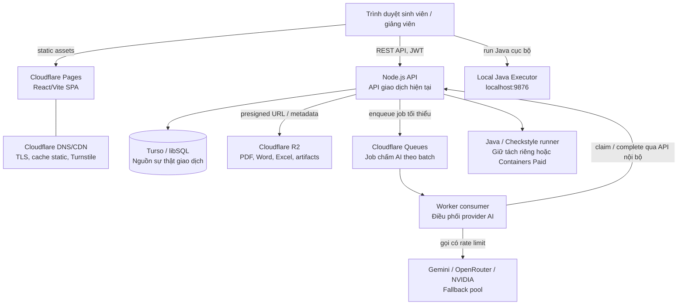
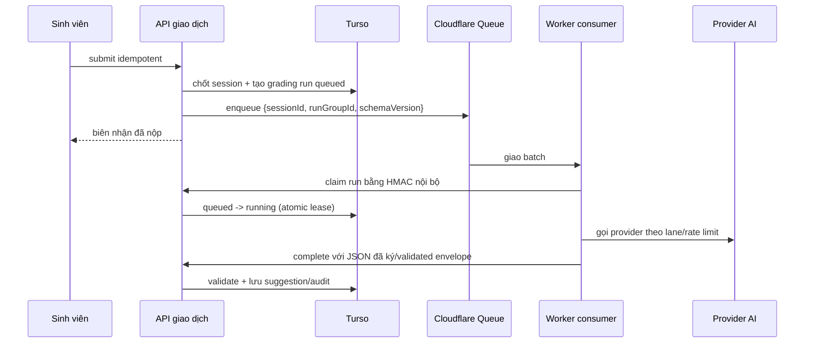

# ADR-004: Kiến trúc vận hành Hybrid Cloudflare

- **Trạng thái:** Được chấp thuận làm kiến trúc đích; triển khai theo từng giai đoạn.
- **Cập nhật:** 03/09/2026.
- **Phạm vi:** Hosting frontend, edge security, file storage, điều phối chấm AI,
  database, backend API và Java runner của OOP Learning Platform.

## 1. Quyết định

Hệ thống không chuyển toàn bộ sang Cloudflare Free trong một lần. Kiến trúc đích là
**hybrid Cloudflare**:

| Thành phần | Vai trò đích | Quyết định giai đoạn đầu |
|---|---|---|
| Cloudflare Pages | Phân phối React/Vite SPA, preview deploy, CDN | Chuyển từ GitHub Pages |
| Cloudflare DNS/CDN/Turnstile | TLS, phân phối edge và xác minh bot tại login/các form công khai | Bật trước khi mở rộng API |
| Cloudflare R2 | Lưu file import, template, PDF/Word export và report artifact | Tiếp tục dùng, chuẩn hóa vòng đời file |
| Cloudflare Queues | Hàng đợi bền vững cho công việc chấm AI bất đồng bộ | Bổ sung sau khi có quan sát quota |
| Cloudflare Worker | Consumer chấm AI và các endpoint edge ngắn, không giữ state nghiệp vụ | Pilot có giới hạn; không thay API ngay |
| Turso/libSQL | Cơ sở dữ liệu giao dịch và nguồn sự thật hiện tại | Giữ nguyên trong các giai đoạn đầu |
| Node.js API hiện tại | Xác thực, phân quyền, autosave, submit, chấm điểm và audit | Target Zeabur theo canary/rollback trong [ADR-005](adr-005-zeabur-backend-migration.md), chỉ sau khi account có compute được phê duyệt; Render là rollback cho đến khi cutover được chứng minh |
| Java/Checkstyle runner | Công việc cần JVM/Linux hoặc CPU đáng kể | Không chạy trên Workers Free; chạy qua Dockerfile trên Zeabur hoặc máy sinh viên |

Mục tiêu của quyết định này là loại bỏ hạn chế static hosting của GitHub Pages và tối ưu
backend với Zeabur APAC nếu canary chứng minh cải thiện so với baseline Render,
**không đánh đổi tính toàn vẹn của ca thi lấy chi phí bằng 0**.

## 2. Bối cảnh và các ràng buộc

Hệ thống hiện có các đặc tính không phù hợp với một lần chuyển đổi "all Cloudflare Free":

1. Backend Express dùng `bcrypt`, tạo PDF/Word/Excel, giao tiếp libSQL và có các luồng
   phân quyền/audit nhiều bước. Đây không phải chỉ là một API đọc dữ liệu ngắn.
2. Bài kiểm tra tạo burst ghi dữ liệu: bắt đầu phiên, autosave, event integrity, submit,
   chấm tự động và ghi audit. Một lần vượt quota write không được phép làm sinh viên mất
   bài hoặc không thể nộp.
3. Checkstyle và các công cụ Java cần JVM/Linux. Cloudflare Containers có thể chạy các
   workload này nhưng thuộc Workers Paid, nên không phải phương án "free".
4. LLM là dịch vụ bên thứ ba có quota và lỗi riêng. Hạ tầng hàng đợi phải tách việc nộp
   bài khỏi việc gọi Gemini/OpenRouter/NVIDIA; không provider nào được quyền làm thất bại
   submit.

Cloudflare Workers Free có 100.000 request/ngày và 10 ms CPU/request. D1 Free có
5 triệu rows read/ngày, 100.000 rows write/ngày và 5 GB storage; khi chạm quota, query
sẽ bị từ chối tới khi quota reset. Những con số này là quota kỹ thuật, không phải cam kết
SLA cho một kỳ thi. Xem [nguồn chính thức](#12-nguồn-và-ngày-xác-minh).

## 3. Kiến trúc đích

### 3.1 Ranh giới trách nhiệm

- **Pages** chỉ phục vụ frontend build. Không đặt secret, answer key, rubric hay quyền
  instructor vào bundle frontend.
- **API Node.js** là authority duy nhất cho start/resume, autosave, submit, score,
  approve, review và audit trong giai đoạn Turso còn là database chính.
- **Turso** là nguồn sự thật cho trạng thái phiên thi, câu trả lời, điểm và trạng thái
  job. Message queue không phải database thay thế.
- **Queues/Worker consumer** chỉ điều phối công việc bất đồng bộ; output LLM luôn là dữ
  liệu không tin cậy và phải được API validate trước khi lưu.
- **R2** chứa object; quyền truy cập file thực hiện qua URL có hạn dùng hoặc endpoint
  API đã kiểm tra phân quyền. Không dùng public bucket cho bài nộp, đáp án hoặc report
  nội bộ.
- **Java runner** không nhận đường chạy trực tiếp từ browser. Local Executor vẫn là lựa
  chọn mặc định để tránh chạy mã Java không tin cậy trên server.

### 3.2 Trạng thái chuyển đổi

Repository hiện có foundation Cloudflare và Zeabur. Chỉ ghi nhận production là Zeabur sau
khi [runbook migration](zeabur-migration-runbook.md) hoàn tất; trước thời điểm đó Render là
API production/rollback. Repository hiện có các rào chắn sau:

- Workflow Pages chỉ chạy khi repository variable `CLOUDFLARE_PAGES_ENABLED=true`; GitHub
  Pages vẫn là artifact rollback trong giai đoạn canary.
- API chỉ cho phép origin Pages của đúng `CLOUDFLARE_PAGES_PROJECT`, không mở wildcard
  `*.pages.dev`; build Pages phải nhận `VITE_API_URL` công khai.
- R2 đã có interface provider, key chuẩn hóa theo prefix và URL ký bị giới hạn 15 phút
  cho export roster. Các loại artifact còn lại phải chuyển dần, có kiểm thử phân quyền.
- Queue bridge, Worker config, HMAC và DLQ đã có trong repository, nhưng mặc định
  `ASSESSMENT_AI_QUEUE_DELIVERY_MODE=durable_db`. Chỉ canary mới được đổi sang
  `cloudflare_queue` sau runbook và readiness check.

Vì thế sơ đồ vẫn là **đích được triển khai từng phần**, không được hiểu là Cloudflare đã
vận hành. Trong mỗi giai đoạn, API public giữ URL và JSON contract hiện có để frontend
không cần big-bang rewrite.

## 4. Luồng ca thi và chấm AI

### 4.1 Luồng đồng bộ, ưu tiên độ tin cậy

Các request sau luôn đi thẳng API giao dịch; không xếp hàng:

1. Login/refresh token, preflight và start/resume.
2. Autosave batch có `revision` tăng dần.
3. Ghi event integrity đã được batch/rate-limit.
4. Submit hoặc auto-submit idempotent.

API trả thành công cho submit ngay khi đã chốt session, đáp án và điểm tự động trong
transaction. Việc LLM chấm tự luận chỉ được tạo sau đó. Nếu queue/provider ngừng hoạt
động, session vẫn ở trạng thái đã nộp và giảng viên vẫn chấm tay được.

### 4.2 Luồng bất đồng bộ cho LLM

Quy tắc bắt buộc:

- Một message biểu diễn **một batch của một lượt nộp**, không tạo message cho mỗi lần
  gõ/autosave. Nếu có nhiều câu tự luận, consumer xử lý theo batch với giới hạn request
  provider cấu hình được.
- Payload queue chỉ chứa ID, version và correlation ID; không đặt câu trả lời, answer
  key, rubric hay API key vào message.
- API nội bộ `claim`/`complete` kiểm tra HMAC theo thời gian, nonce chống replay, audience
  riêng và service identity. Không dùng JWT của sinh viên/giảng viên cho callback này.
- `claim` có lease; job stale được retry an toàn. Cùng một run không được có hai consumer
  đang chấm. `complete` phải idempotent theo `runId` và provider attempt.
- Consumer dùng pool Gemini → OpenRouter → NVIDIA theo cấu hình hiện hành, quota/rate
  limit từng provider và circuit breaker. Provider thất bại không làm retry vô hạn.
- Kết quả chỉ là `suggestedScore`; điểm chính thức vẫn tuân thủ workflow duyệt/chấm lại
  của giảng viên.

#### Cầu nối triển khai đầu tiên

Lần triển khai đầu tiên dùng Worker như **delivery bridge**: API tạo run trong Turso trước,
gửi message ID-only có HMAC đến `/enqueue`; Worker đưa message vào Queue rồi gọi callback
nội bộ có chữ ký để backend claim/xử lý chính run đó. Backend worker cũ vẫn chạy như cơ chế
recovery. Đây là chủ đích để giữ toàn bộ provider key do admin cấu hình, validator JSON và
audit ở authority hiện tại trong lúc canary.

Không bật flag chỉ vì Worker deploy thành công. Giai đoạn sau mới tách đầy đủ
`claim -> provider -> complete` để Worker gọi provider bằng secret riêng, sau khi xác nhận
được đồng bộ cấu hình provider, quota, recovery và khả năng rollback. Cầu nối hiện tại đã
an toàn với delivery lặp vì lease database là điểm quyết định duy nhất, nhưng chưa được xem
là bước thay thế backend chấm AI.

## 5. Chiến lược database: giữ Turso trước, đánh giá D1 sau

Turso được giữ trong các giai đoạn đầu vì code hiện dùng `@libsql/client` và Drizzle libSQL,
và quota Free hiện là 5 GB, 500 triệu rows read/tháng, 10 triệu rows write/tháng. D1 là
lựa chọn tốt để giảm độ trễ đọc ở edge trong tương lai, nhưng quota write của D1 là theo
**ngày** và bị enforce cứng; migration không chỉ là đổi connection string.

Chỉ mở migration D1 khi tất cả điều kiện sau đạt:

1. Có báo cáo tải thật và load test đại diện cho ca thi lớn nhất dự kiến.
2. Mức đỉnh dự báo của D1 dưới 20% quota daily cho reads và writes, kể cả retry,
   index-write overhead và biên độ sự cố 5 lần.
3. Tất cả truy vấn theo `assessment_assignment_id`, `session_id`, `student_id`,
   `status`, `created_at` có index phù hợp và không còn full-table scan trong luồng thi.
4. Có backup đã khôi phục thử nghiệm, migration một chiều có checksum, và rollback chỉ
   chuyển traffic về Turso chứ không rollback dữ liệu bằng tay.
5. Đã kiểm thử transaction/concurrency, timezone, unique constraint, query dialect và
   Drizzle D1 adapter trên bản sao dữ liệu đã ẩn danh.

Không dual-write Turso/D1 trong ca thi thật. Nếu cần so sánh, chỉ shadow-read dữ liệu
không nhạy cảm hoặc replay log đã ẩn danh ngoài giờ thi.

## 6. Ngân sách quota và cơ chế bảo vệ

Ngưỡng vận hành ban đầu phải được cấu hình, đo trong dashboard và cảnh báo trước khi
chạm hard limit. Không hard-code quota vào business logic vì nhà cung cấp có thể thay đổi.

| Dịch vụ | Free quota tham chiếu | Ngân sách vận hành ban đầu | Hành động khi vượt ngưỡng |
|---|---:|---:|---|
| Workers | 100.000 request/ngày, 10 ms CPU/request | Cảnh báo 60%, chặn rollout 80% | Không đưa mọi API qua Worker Free; hạ traffic không thiết yếu |
| Queues | 10.000 operations/ngày, retention 24 giờ | Cảnh báo 50%, tạm dừng enqueue không khẩn cấp 70% | Giữ job trong DB; gộp batch hoặc chuyển sang worker paid |
| D1 (nếu pilot) | 5M rows read/ngày; 100k rows write/ngày; 5 GB | Chỉ pilot dưới 20% hard quota | Fail closed cho migration, traffic quay lại Turso |
| R2 | 10 GB-month; 1M Class A; 10M Class B/tháng | Cảnh báo 60%, lifecycle cleanup 80% | Xóa export hết hạn, chặn file không cần thiết |
| Turso | 5 GB; 500M reads/tháng; 10M writes/tháng | Cảnh báo 60%, review 80% | Giảm autosave/log thừa, nâng plan trước ca thi |

`quota-status` phải hiển thị ít nhất: usage hiện tại, reset time, dự báo cuối kỳ, số
message queue backlog/oldest message, số grading run `queued/running/failed`, provider
RPM và số retry. Mọi cảnh báo quota phải gửi tới admin trước ca thi, không chỉ xuất hiện
trên dashboard.

## 7. Bảo mật và chống lạm dụng

1. Cloudflare Turnstile được dùng cho login, reset password và import công khai có nguy
   cơ bot; không hiển thị captcha ở autosave/submit của session đã xác thực.
2. Rate limit theo user + assignment/session, không chỉ theo IP. Đặc biệt giới hạn login,
   start, password assessment, submit, flag integrity và AI retry.
3. CORS allow-list chỉ nhận các domain Pages/custom domain đã công bố. Cookie chỉ dùng
   nếu có chiến lược CSRF rõ ràng; bearer token hiện hành vẫn phải kiểm tra audience,
   expiry và role ở API.
4. Worker secret, Turso token, R2 key và provider API key đặt ở secret manager; không
   có trong GitHub Actions log, frontend environment hay queue payload.
5. Pages/Workers log không được ghi raw answer, answer key, password đề, Authorization
   header hoặc prompt đầy đủ. Dùng request ID/hashed session ID để truy vết.
6. Không coi browser anti-cheat, Turnstile hoặc Workers là công cụ ngăn được mọi extension
   hay DevTools. Chúng là tín hiệu audit để giảng viên quyết định, không phải bằng chứng
   tuyệt đối.

## 8. Lộ trình không gián đoạn

### Giai đoạn 0 — Đo và chuẩn bị

- Ghi baseline p50/p95/p99 cho login, start, autosave, submit và danh sách lớp.
- Đếm rows read/write, request, kích thước file, LLM run, retry và event integrity theo
  từng assessment assignment.
- Viết runbook ca thi, export backup, và test khôi phục Turso/R2 trước khi đổi traffic.

### Giai đoạn 1 — Frontend/edge an toàn

- Deploy Vite SPA lên Cloudflare Pages; tạo preview deploy cho pull request.
- Chuyển custom domain/DNS, TLS, security headers và SPA fallback; giữ GitHub Pages làm
  rollback artifact trong một kỳ triển khai.
- Xác minh API base URL, CORS, deep link, cache invalidation sau deploy và CSP.

### Giai đoạn 2 — Object storage và quan sát

- Chuẩn hóa key R2 theo `environment/resource/id/version`; dùng presigned URL ngắn hạn.
- Có lifecycle cho import tạm, export, artifact source-check và PDF/Word đề thi.
- Mở quota dashboard, alert và retention policy trước khi thêm queue.

### Giai đoạn 3 — Queue chấm AI

- Triển khai queue consumer trên Worker với endpoint claim/complete nội bộ.
- Canary cho một assessment không trọng yếu; giới hạn concurrency, provider RPM và
  backlog. Có dead-letter/retry record trong database.
- Chỉ chuyển ca thi thật khi kiểm thử tải chứng minh submit thành công khi toàn bộ provider
  AI bị tắt hoặc queue bị chặn.

### Giai đoạn 4 — Worker API pilot

- Chỉ đưa endpoint đọc/cache hoặc edge-specific nhỏ sang Worker trước.
- Không chuyển login bcrypt, autosave, submit, generate document hay Java tooling vào
  Workers Free.
- So sánh lỗi, p95 latency, quota và audit với API Node.js trước khi mở rộng.

### Giai đoạn 5 — Quyết định D1 và Java runner

- Thực hiện checklist ở phần 5 để quyết định D1 hoặc tiếp tục Turso.
- Nếu cần JVM/server runner, so sánh runner hiện tại với Cloudflare Containers Paid dựa
  trên tải, isolation, chi phí và recovery. Không chạy mã Java sinh viên không tin cậy
  chỉ vì đổi hạ tầng.

### Rollback

Mỗi giai đoạn cần feature flag và rollback độc lập:

- Pages: chuyển DNS/build artifact về frontend trước đó.
- Queue: dừng producer, giữ run `queued` trong Turso và để backend worker cũ/manual
  recovery xử lý.
- Worker pilot: route trở lại Node API ngay, không đổi API contract.
- D1: route trở lại Turso; không ghi vào hai database trong ca thi.

## 9. Tiêu chí chấp nhận trước một ca thi thật

1. Load test với số sinh viên đồng thời mục tiêu được phê duyệt, gồm start burst,
   autosave, submit burst, retry mạng và LLM outage.
2. 100% submit trong test outage được chốt idempotent; không phụ thuộc queue/LLM.
3. p95/p99, error rate, row usage, quota headroom và queue backlog được công bố cho
   người vận hành trước giờ mở đề.
4. Có bản backup khôi phục thử nghiệm thành công và một người trực có quyền rollback.
5. Không có answer key, rubric, đề password hay raw answer trong frontend bundle, queue
   payload, analytics, log edge hay error report.
6. Trong ca thi không triển khai migration schema, đổi provider, đổi route hay deploy
   frontend/backend trừ xử lý sự cố đã được phê duyệt.

## 10. Những gì không giải quyết

- Không có free tier nào thay thế một SLA cho kỳ thi chính thức. Nếu deadline/điểm có hệ
  quả lớn, cần compute luôn bật và ngân sách sự cố rõ ràng.
- Cloudflare Workers không thay Local Executor hoặc một sandbox JVM an toàn miễn phí.
- Turnstile và chống copy/tab/devtools phía browser không thể vô hiệu hóa tuyệt đối extension
  hay thiết bị thứ hai.
- Cloudflare Workers AI không được mặc định thay thế pool Gemini/OpenRouter/NVIDIA cho
  chấm điểm chính thức; việc thêm provider mới phải qua cùng validator, quota và review
  workflow.

## 11. Hệ quả đối với codebase

- Tách interface `StorageProvider`, `AssessmentAiQueue`, `AssessmentAiConsumerClient` và
  `MetricsReporter` khỏi controller/route để provider không rò vào business logic.
- Chuẩn hóa correlation ID qua browser → API → queue → consumer → provider → audit.
- Tất cả mutation assessment dùng idempotency key hoặc revision/optimistic lock.
- Export PDF/Word/Excel được tạo ở API/runner phù hợp, upload R2 rồi trả URL có hạn dùng;
  không tạo file trong filesystem tạm như nơi lưu vĩnh viễn.
- Mọi migration hạ tầng cần test contract API và migration smoke-test, không chỉ typecheck.

## 12. Nguồn và ngày xác minh

Các quota có thể thay đổi; kiểm tra lại dashboard trước mỗi quyết định triển khai.

- [Cloudflare Pages pricing](https://developers.cloudflare.com/pages/functions/pricing/) —
  static assets free/unlimited; Pages Functions dùng quota Workers.
- [Cloudflare Workers limits](https://developers.cloudflare.com/workers/platform/limits/) —
  Workers Free: 100.000 request/ngày, 10 ms CPU/request.
- [Cloudflare D1 pricing](https://developers.cloudflare.com/d1/platform/pricing/) —
  read/write/storage quota và hành vi khi chạm giới hạn.
- [Cloudflare Queues pricing](https://developers.cloudflare.com/workers/platform/pricing/) —
  10.000 operations/ngày trên Free, retention 24 giờ.
- [Cloudflare R2 pricing](https://developers.cloudflare.com/r2/pricing/) — quota object
  storage/operation và egress.
- [Cloudflare Containers](https://developers.cloudflare.com/containers/) — Containers yêu
  cầu Workers Paid.
- [Turso pricing](https://turso.tech/pricing) — quota free libSQL hiện hành.
- [Zeabur Free Plan](https://zeabur.com/docs/en-US/pricing/free-plan) — auto-sleep và không có SLA; kiểm tra quyền tạo project, nguồn compute, quota/region thực tế trong dashboard.
- [ADR-005: Chuyển đổi Backend API sang Zeabur](adr-005-zeabur-backend-migration.md) và [runbook](zeabur-migration-runbook.md) — thiết kế, canary và rollback.
- [Render Free limitations](https://render.com/docs/free) — free web service spin down sau
  idle, latency cao từ Việt Nam.
- [GitHub Pages limits](https://docs.github.com/en/pages/getting-started-with-github-pages/github-pages-limits)
  — giới hạn và khuyến cáo về sensitive transactions.
